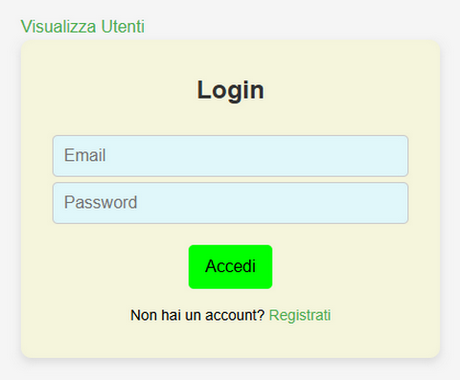
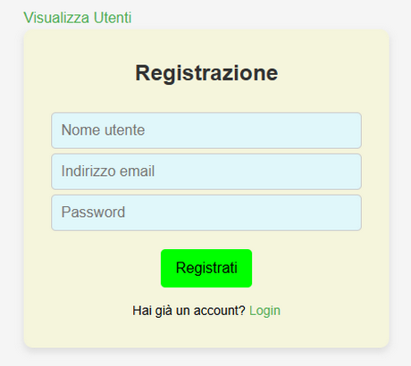
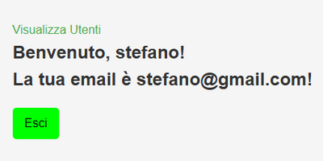
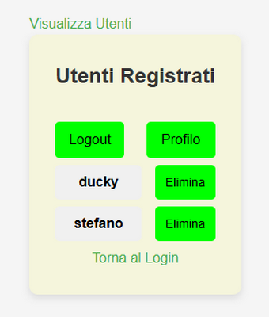

## ⚛️🔐 React Frontend – User Authentication App

This is the frontend for a user authentication app built with React and Vite. 
 
It allows users to register, log in, view their profile, and access a protected 
 
list of registered users. 
 
Authentication is handled securely using JWTs stored in HttpOnly cookies.
 
The frontend of this project is connected and managed by the [Netlify](https://www.netlify.com/) site
 
and the backend by the [Render](https://www.render.com/) site. 
 
The database is hosted on the [MongoDB](https://www.mongodb.com/) site. 
 
Environment variables must be set on the [Netlify](https://www.netlify.com/) site
 
The [auth-jwt-backend](https://github.com/stecavalli/auth-jwt-backend) repository is an integral part of this project.

## ✅ Features

- User registration
- Secure login and logout (using cookies)
- Protected profile page
- Protected user list page with delete option
- Route protection via `PrivateRoute`
- Backend communication via `fetch` with `credentials: "include"`

## 🛠️ Technologies Used

- React
- React Router DOM
- Vite
- Fetch API

## 📦 Clone the Project

git clone https://github.com/stecavalli/auth-jwt-frontend.git
 
cd auth-jwt-frontend

## 🔧 Environment Setup

<i>Create a `.env` file in the root of the project with:</i>
  
VITE_API_URL=https://<TUO_NOME_SITO_PERSONALIZZATO>.onrender.com  &nbsp;&nbsp;&nbsp;&nbsp;*** Url to set directly on the [Netlify](https://www.netlify.com/) site. ***
 
VITE_API_URL=http://localhost:5173  &nbsp;&nbsp;&nbsp;&nbsp;*** Url for local testing, replace 5173 with the actual port number. ***

## ✏️ Local Test File Changes
This repository and its backend repository are configured to run on the servers listed above. 
 
To run locally on your PC, some changes to three files in the backend are required, and the 
 
.env files need to be added to both repositories. 
 
Here are the changes needed:
 
In this repository you just need to add the .env file as described above.
 
Go to the [auth-jwt-backend](https://github.com/stecavalli/auth-jwt-backend) repository to see the changes you need to make.

## ▶️ Getting Started

1. Install dependencies:

   npm install

2. Start the development server:

   npm run dev

## 🔐 Authentication Flow
On login or registration, a secure cookie (HttpOnly) is set by the backend.

All subsequent requests include the cookie via credentials: "include".

The getLoggedInUser() helper checks user auth status.

PrivateRoute protects routes based on authentication.

## 🚀 Deployment
You can deploy the frontend with services like [Netlify](https://www.netlify.com/) or [Vercel](https://vercel.com). 
 
Make sure to set the correct VITE_API_URL in your environment variables.

## 📬 API Endpoints (Used by Frontend)
These endpoints should be exposed by your backend:

POST /api/register – Register a new user

POST /api/login – Log in a user

POST /api/logout – Log out current user

GET /api/me – Get logged-in user

GET /api/users – List all users

DELETE /api/users/:username – Delete a user

## ⚛️ React + Vite

This template provides a minimal setup to get React working in Vite with HMR and some ESLint rules.

Currently, two official plugins are available:

- [@vitejs/plugin-react](https://github.com/vitejs/vite-plugin-react/blob/main/packages/plugin-react/README.md) uses [Babel](https://babeljs.io/) for Fast Refresh
- [@vitejs/plugin-react-swc](https://github.com/vitejs/vite-plugin-react-swc) uses [SWC](https://swc.rs/) for Fast Refresh

## ⚙️ Expanding the ESLint configuration

If you are developing a production application, we recommend using TypeScript and enable type-aware lint rules. 
Check out the [TS template](https://github.com/vitejs/vite/tree/main/packages/create-vite/template-react-ts) 
to integrate TypeScript and [`typescript-eslint`](https://typescript-eslint.io) in your project.

## 🌐 Frontend Page Examples

When you open the site on Netlify, you will see the login page and you can
 
go to the Register page, which are very similar to the following images:
  

  
by logging in you will be redirected to the profile page and by clicking 
 
on view users you will navigate to the user list page:
  

